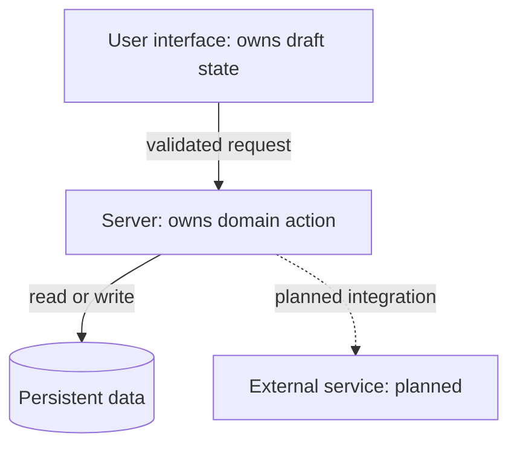
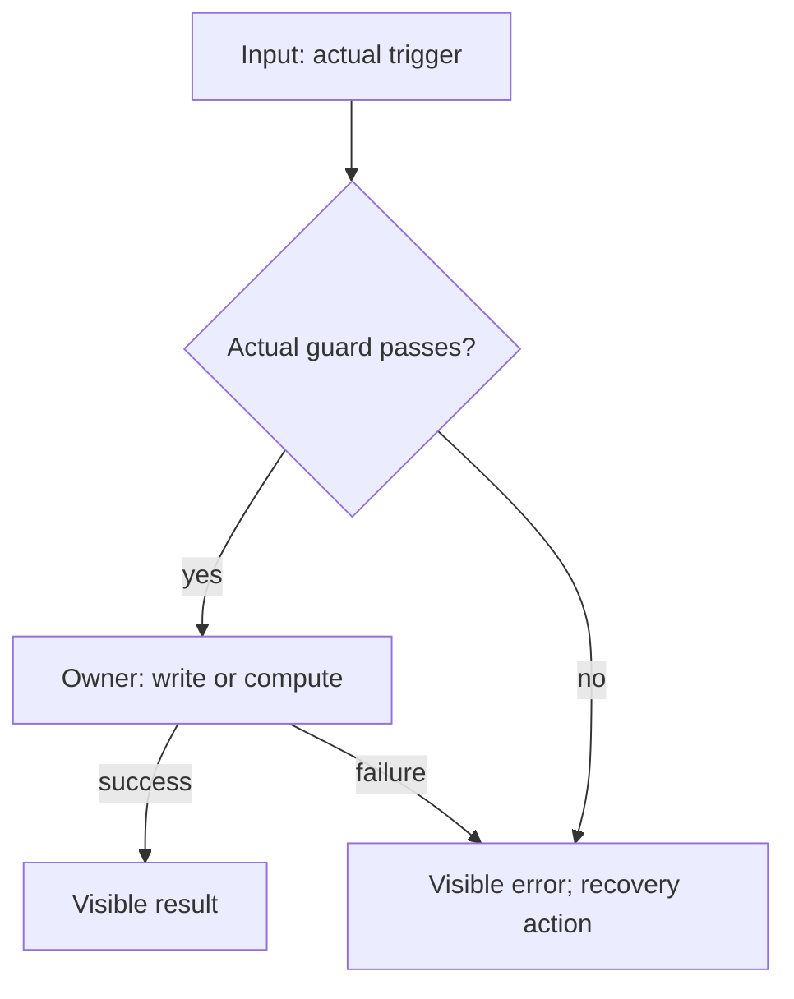
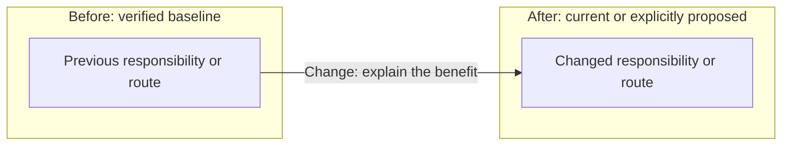

# Architecture views for a feature

Help the reader answer three questions: how does the system work, how does this
feature reach its result, and what does this change enable? Keep the system
overview in the application's existing architecture context. Keep feature and
change views beside the feature or task that owns them; link instead of copying.
For a small Explore change, reuse the overview and explain the delta briefly.

These are placeholders for adoption, not implemented integrations. Replace every
label, source and condition before presenting a view as current.

## System responsibilities

Start with the user-facing owner, the meaningful server owner, persistent data
and any external service. Add detail only when it helps explain a boundary.

Under the view, link each current node to its source owner and name the function
that demonstrates each arrow. State where temporary state and saved data live.
Use a dashed arrow and the word planned for an integration that does not exist.
Label fixtures or simulated behaviour directly. Distinguish source inspection,
local execution and verified live integration.

## Feature from input to result

Show one trigger, its guard, its write or computation, and the visible result.
Include the useful failure path. A read can have side effects; inspect it.

Record the input, state owner, guard owner, persistent write and result owner.
Explain cancellation, retries or partial results only where the feature has
them. Do not imply that shape validation provides authorisation.

## What the change enables

State the user benefit, then show the affected ownership or flow before and
after. Link the relevant diff, decision or task evidence. If the change only
affects documentation or presentation, say that rather than inventing a new
runtime path. Keep unrelated subsystems out of the view.

Include the affected boundary, behaviour proof, remaining limit and recovery.
For a documentation-only change, recovery is reverting the document edit.

## Keep the explanation current

Update a view when a change moves state, ownership, persistence, integrations or
an important failure path. Styling changes can reuse it. Record the reviewed
source revision or date and relevant feature flag or environment condition.
Replace superseded current views; keep a labelled baseline only when it explains
the change. Avoid a second architecture owner or a document for every prompt.

Before delivering, trace every arrow to code or a planned label, resolve source
links, render and inspect the diagrams, and ask the reader whether they can find
the state, write and change quickly. Tool success proves structure and
rendering; reader feedback establishes comprehension. Try the pattern on
[the Data Miner walkthrough](../../docs/architecture/data-miner.md).
