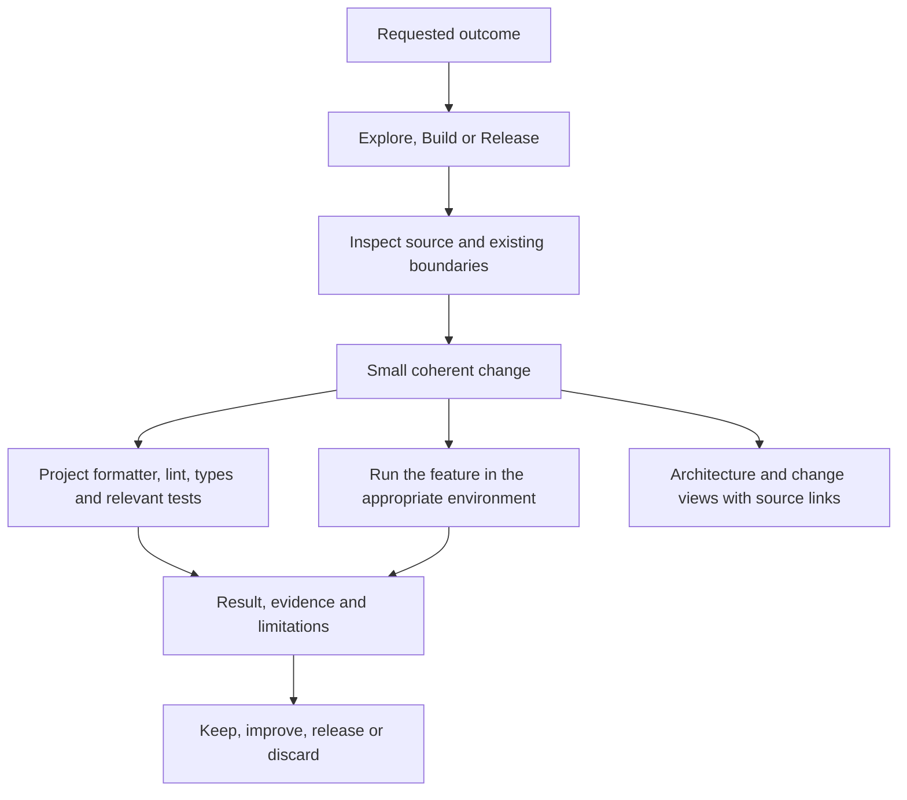

# Harness architecture

## Current state

The reset commit `0516ee6` retained `.editorconfig` and `.gitignore`. The rebuild
adds a working agreement and plan. The old GitHub CI workflow was removed.
No runtime, database, project scanner, installer or `harness` command exists.
P001-T002 adds native checks for the files actually shipped.

| Responsibility | Current owner |
| --- | --- |
| Workflow and quality principles | [WORKFLOW.md](WORKFLOW.md) |
| Rebuild outcomes and evidence | [P001](../project/plans/P001-lean-harness.md) |
| Editor conventions | [.editorconfig](../.editorconfig) |

## Intended operation

This diagram is a proposed design. Executable checks and isolation recipes will
be added and exercised by the remaining tasks.

The harness supplies a working agreement, small native configurations and
tested recipes. Each application owns its product decisions, code, data and
native commands. Programming tools check precise properties; the agent explains
responsibilities and choices; the user judges whether the result is useful and
understandable.

The initial architecture views will be maintained diagrams in the project.
P001-T004 will test whether this is sufficient. A dashboard or automatic scanner
is deferred until we observe a gap that these views cannot address.
