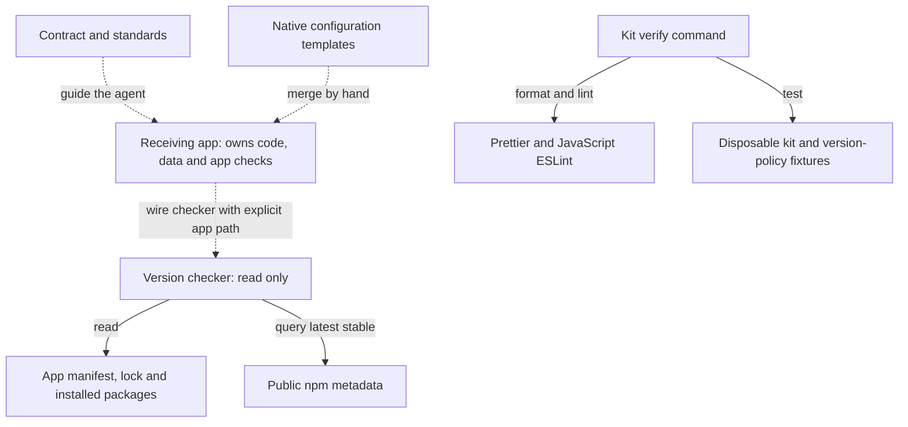
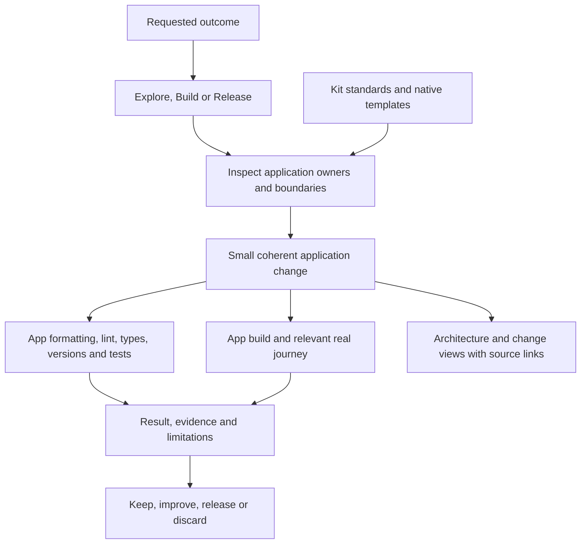

# Harness architecture

## Current state

The kit holds instructions, native configuration templates, JavaScript tools and
their tests. The Next.js validation app was removed after proving the initial
settings. The root installs only its formatting and JavaScript lint
dependencies. Application runtime and dependencies belong to receiving apps.

| Responsibility                     | Current owner                                                                                               |
| ---------------------------------- | ----------------------------------------------------------------------------------------------------------- |
| Agent contract                     | [AGENTS.md](../AGENTS.md)                                                                                   |
| Workflow and quality principles    | [WORKFLOW.md](WORKFLOW.md)                                                                                  |
| Engineering and language standards | [standards](../.harness/standards/BASE.md)                                                                  |
| Next.js native adoption configs    | [templates](../.harness/templates/nextjs/README.md)                                                         |
| Kit command entrypoints            | [package.json](../package.json)                                                                             |
| Shared formatting                  | [.prettierrc.json](../.prettierrc.json) and [.editorconfig](../.editorconfig)                               |
| Kit JavaScript lint                | [eslint.config.mjs](../eslint.config.mjs)                                                                   |
| Stable application versions        | [checker](../scripts/check-framework-versions.mjs) and [policy tests](../tests/framework-versions.test.mjs) |
| Disposable kit failure probes      | [native-checks.test.mjs](../tests/native-checks.test.mjs)                                                   |
| Rebuild outcomes and evidence      | [P001](../project/plans/P001-lean-harness.md)                                                               |

## Current boundaries

Solid arrows are implemented kit commands and reads. Dashed arrows are manual
adoption guidance; this kit has no installer that wires consumer checks. The
command, tool, test and checker nodes link to the owners in the table above. The
adoption boundary is defined by the
[Next.js instructions](../.harness/templates/nextjs/README.md). The checker
compares versions and prints a result or exits with an error; it writes no app
files or data. Tests create and remove only their temporary fixtures.

Kit checks cover kit formatting, JavaScript lint and behaviour tests. Native
failure probes copy only kit configuration into a unique temporary directory,
reuse the kit's installed tools, inject faults and remove that fixture.

The version checker requires an explicit installed npm app directory. It reads
that app's exact pins, lock entries and installed packages, then compares them
with npm's live stable releases. It has no write or install behaviour. Policy
tests use labelled synthetic metadata and package files; a live run needs the
actual app and registry access. Receiving apps must wire this gate into their
own setup and full verification.

No database, project scanner, installer, CI workflow, app server or `harness`
wrapper exists here. Broader application and database isolation is P001-T003
work. Prior React and browser verification remains historical evidence in P001.

## Intended operation

The harness supplies principles and settings; each application owns the code,
data, dependencies and executable verification for its product.

Programming tools check precise properties; the agent explains responsibilities
and choices; the user judges whether the result is useful and understandable. An
import graph can assist inspection but cannot establish business meaning.

The architecture views are maintained diagrams in the project. The
[Data Miner walkthrough](architecture/data-miner.md) shows a current system
overview, company-save flow and the effect of this documentation change. The
[reusable format](../.harness/templates/architecture.md) explains how to
maintain those views in a receiving application. Link a source owner for each
runtime node and trace each arrow to its function. Update views when state,
writes, ownership or integrations change. The user confirmed this walkthrough is
clear on 2026-10-08. Future views still need reader feedback; a dashboard or
scanner remains deferred.
