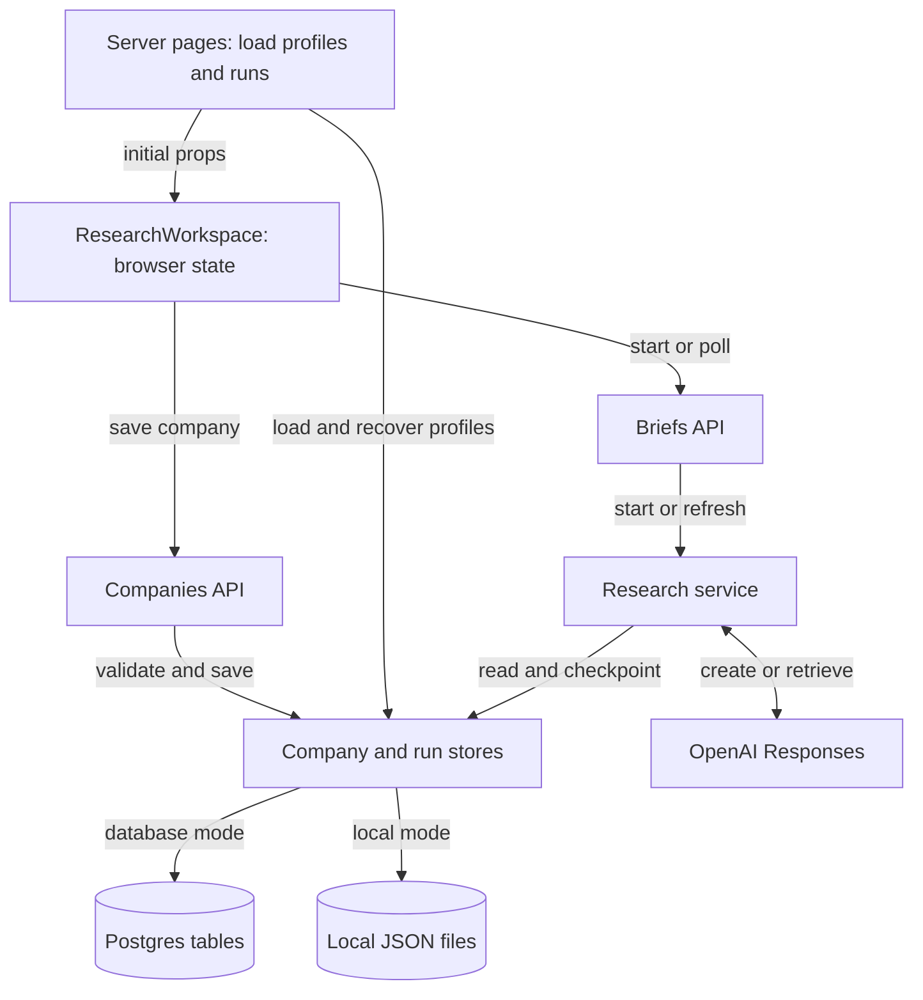
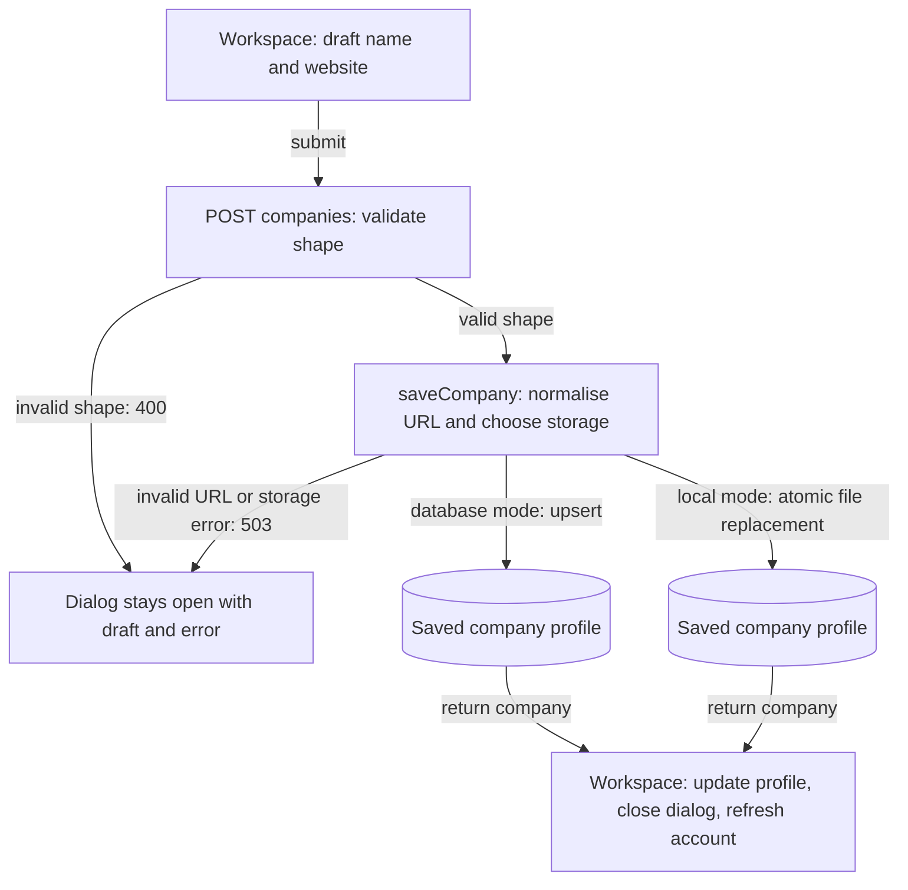
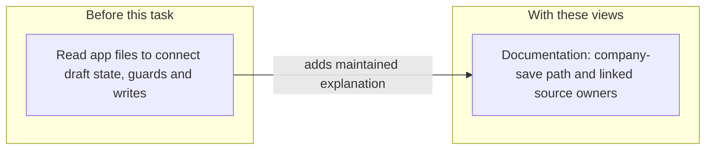

# Data Miner company and research flow

Data Miner loads saved company profiles and research runs into a browser
workspace. Saving company details writes a profile. Starting research follows a
separate path through the research service and OpenAI Responses.

Current source snapshot: 2026-10-08, Data Miner revision `a047ea4`. This view
covers company setup and research execution. Database and provider paths are
identified from source; they were not exercised for this review. Source links
assume the Data Miner checkout is beside this kit.

## System responsibilities

The workspace owns selected company, draft fields, loading flags, errors and the
displayed runs. The server stores own saved profiles and research checkpoints.
Database mode uses `DATABASE_URL` or `NEON_DATABASE_URL`; local JSON mode
applies only off Vercel with neither variable set. Vercel requires database
configuration, and database errors are surfaced rather than switching to files.

| Node                     | Source and responsibility                                                                                                                                                               |
| ------------------------ | --------------------------------------------------------------------------------------------------------------------------------------------------------------------------------------- |
| Server pages             | [Home](../../../data-miner/app/page.tsx) and [account page](../../../data-miner/app/accounts/[slug]/[[...view]]/page.tsx): load runs and profiles, pass initial props                   |
| ResearchWorkspace        | [Workspace](../../../data-miner/components/research-workspace.tsx): React state, `saveSetup`, `start`, polling and rendering                                                            |
| Companies API            | [Companies route](../../../data-miner/app/api/companies/route.ts): shape validation and `saveCompany`                                                                                   |
| Briefs API               | [Briefs route](../../../data-miner/app/api/briefs/route.ts): `startResearch` and `refreshResearch`                                                                                      |
| Research service         | [Service](../../../data-miner/research/service.ts): dispatch, retrieval and checkpoint progression                                                                                      |
| OpenAI Responses         | [Runner](../../../data-miner/research/run.ts): `runResearch` creates background responses; the service retrieves them                                                                   |
| Company and run stores   | [Company storage](../../../data-miner/research/companies.ts) and [run storage](../../../data-miner/research/store.ts): persisted profiles and runs                                      |
| Postgres and JSON choice | [Database connection](../../../data-miner/research/database.ts) and `localMode` in the run store; profile writes use `simple_research_companies`, run writes use `simple_research_runs` |

Polling is part of execution: `GET /api/briefs?id=…` can save checkpoints and
start the final synthesis when the first five sections are terminal. It is not
an independent scheduler. Company listing can also recover profiles from older
runs and save them. These are write paths even when the caller is loading data.

## Saving company details

The draft lives in `setupName` and `setupWebsite`, not in saved research. The
shared [DetailPanel](../../../data-miner/components/research-module.tsx) owns
dialog focus and dismissal; the workspace supplies the company form. Cancel
closes the panel without submitting. `saveSetup` sends the two fields to the
companies route and updates browser state only after a successful response.

The route checks `companySchema` in
[the schemas](../../../data-miner/research/schema.ts). `saveCompany` checks the
name again, normalises the website with `websiteUrl`, and chooses storage.
Postgres writes use an upsert keyed by company slug. Local writes replace the
profile file through a temporary file and rename. The input guards check shape
and website format; the route contains no user authorisation check.

On success, the workspace receives the saved profile, updates `companies` and
the selected company, closes setup and refreshes the account route. On failure,
it keeps the panel and draft and displays `setupError`. Saving company details
does not call `startResearch`, create a run or submit a provider request.

| Arrow                     | Source evidence                                                                             |
| ------------------------- | ------------------------------------------------------------------------------------------- |
| Draft to POST             | `saveSetup` in the workspace sends `{ name, website }`                                      |
| Shape guard               | `POST` in the companies route calls `companySchema.safeParse`; failures return 400          |
| URL and storage choice    | `saveCompany`, `websiteUrl` and `localMode`; thrown errors reach the route's 503 reply      |
| Persistent write          | Company store's SQL upsert or `writeFile` followed by `rename`                              |
| Success to visible result | `saveSetup` updates state, clears setup, pushes the account path and calls `router.refresh` |
| Failure to retained draft | `saveSetup` catches the error, sets `setupError` and clears `saving`                        |

## What this architecture work changes

This change makes the state owner and write paths reviewable together. It adds
explanation to the harness; Data Miner's application behaviour stays the same.

The arrow describes added documentation, not application execution. The baseline
is the kit architecture at revision `ed3f354`; the new owners are this
walkthrough, [the kit overview](../ARCHITECTURE.md) and
[the reusable format](../../.harness/templates/architecture.md). The changed
boundary is documentation. No component, API, provider call, schema or stored
record changes. Recovery is an ordinary documentation revert. Future changes
must update views when the shown state, write or integration owners move.

## Readability check

In about two minutes, use the views to identify who owns an unsaved website,
where Save company persists it, whether that action starts research, and which
boundary this task changed. Source matching and rendering can be checked by
tools; whether this is clear enough needs the reader's feedback.

On 2026-10-08, the user confirmed: "Yes, the views make it clear." This accepts
the example's clarity; it does not establish a timed benchmark or prove future
views will be understandable.
