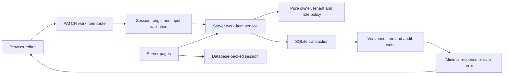

# Reference architecture

Status: current

## Reviewer map

This is a local synthetic reference app with real session/storage behaviour.
Production identity, SSO and deployment are unsupported. The map describes
implemented boundaries, checked against source on 2026-10-07.

Flow arrows show execution/data movement, not permission to import any layer.
The UI imports domain types; server-only adapters stay outside client bundles.

| Component          | Owns / source                                                                                               | Choice and reviewer concern                                                                             |
| ------------------ | ----------------------------------------------------------------------------------------------------------- | ------------------------------------------------------------------------------------------------------- |
| Pages and editor   | [detail page](../src/app/work-items/%5Bid%5D/page.tsx), [editor](../src/components/work-item-editor.tsx)    | Server retrieval plus small client draft/dialog state; client validation is not authorization           |
| HTTP boundary      | [PATCH route](../src/app/api/work-items/%5Bid%5D/route.ts), [HTTP helpers](../src/server/http.ts)           | Runtime schema, authenticated principal and exact mutation origin; safe status/errors                   |
| Session            | [session service](../src/server/session.ts)                                                                 | iron-session seals cookies; database sessions own expiry/revocation/roles; Argon2 verifies credentials  |
| Access policy      | [canAccess](../src/domain/access.ts)                                                                        | Owner and tenant for reads, plus editor role for writes; pure policy independent of storage             |
| Data service       | [work items](../src/server/work-items.ts), [database](../src/server/database.ts)                            | Prepared statements, version conflict and atomic item/audit write; minimal DTOs                         |
| UI foundation      | [components](../src/components/ui), [theme tokens](../src/app/globals.css)                                  | One owned kit across Paper/Ink; no shared-package extraction                                            |
| Behaviour evidence | [direct HTTP cases](../tests/server/http.test.ts), [browser journeys](../tests/navigation/journeys.test.ts) | Production build, real synthetic sessions and disposable SQLite; inspect assertions and storage effects |

## Choices, failures and operation

Read [local decisions](DECISIONS.md), [data contract](DATA.md) and
[security limits](SECURITY.md) before changing identity or persistence. Native
imports/build rules protect demonstrated boundaries; automated passes do not
certify the architecture or production readiness.

On save, the HTTP layer rejects anonymous/unsafe requests and malformed input.
The service hides missing/inaccessible resources, denies viewer writes and
returns a conflict for a stale version. Item and audit writes share a
transaction;
an audit failure rolls back the edit and yields a safe recoverable error. Reads
are private/uncached. The UI allows reload/retry; server policy remains required
even when a control is hidden or disabled.

Runtime/setup only target marked local SQLite; generated credentials and storage
remain private, ignored and synthetic. Test scripts own disposable fixtures and
production-build processes; cleanup has interruption/crash limits. No production
rollout or database rollback procedure is claimed. Source rollback is reverting
the change; resetting local data destroys that fixture and must never be used
as an implicit recovery for user data. See the [data context](DATA.md).

[QH-12](../../../project/plans/P002-quality-first-harness/evidence/QH-12.md)
supplies journey evidence.
[QH-13](../../../project/plans/P002-quality-first-harness/evidence/QH-13.md)
supplies native UI evidence with human
visual acceptance still pending. Review changes through the
[reviewer entry](../../../docs/README.md) and task brief.

## System shape

Next.js App Router pages/layout are Server Components. Only theme selection,
edit draft, dialog, sign-in/out and error recovery use browser state.
Server-only
data access validates stored rows and emits minimal DTOs. Pure access policy is
independent of I/O; Zod validates untrusted JSON at HTTP entry points. Node's
SQLite driver executes prepared statements and real transactions. Iron-session
owns cookie sealing/verification; Argon2 owns password hashing. The database
stores revocable sessions and roles rather than trusting cookie role claims.
Vitest first calls actual production HTTP, then tests domain/client controls.
Playwright calls the real production build with unique disposable SQLite and
actual credential sessions. Test-only scripts own fixture processes/storage;
audit failure injection uses a real SQLite trigger, never a production switch.
The native runner explicitly stops its recorded server children and process
group even when interrupted before Playwright installs its own teardown.
Step 13 keeps axe, keyboard, pixel comparison and lab budgets in native project
tests. The existing JUnit adapter delegates all cases; no application-specific
engine or extra policy language is introduced. Missing human screenshot approval
is a visible native failure, not a silently skipped control.

## Boundaries

UI imports domain types, not server adapters. Pages retrieve server data and
pass serializable values to the editor. Native ESLint protects the demonstrated
UI/domain imports; Next.js enforces server-only boundaries at build time.
The Next.js/React dependencies and all app files are project-owned; lockfile
updates require review. There is no shared-package extraction or installer.

## External systems

No live systems. Explicit setup downloads registry packages and Chromium.
Application verification runs with synthetic input under the external macOS
direct-egress policy; loopback server only. Browser routes additionally deny
non-local traffic, but that route rule is not the OS sandbox.
