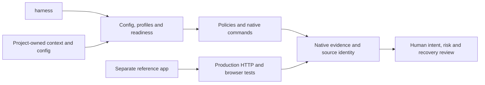

# Architecture

Current local harness plus separately owned synthetic Next.js reference.
[Systems](systems.md) · [Features](features.md) ·
[Decisions](../../docs/DECISIONS.md)

## System shape

## Boundaries

| Layer | Owns | Review concern |
| --- | --- | --- |
| `project/`, `docs/`, project config | Intent, work, current design, evidence | Project-owned; preserve conflicts/history |
| `.harness/`, listed skills | Shared resolution, checks and contracts | Exact managed inventory; native tools own execution |
| `examples/nextjs-app/` | Application, credentials, storage and UI | Synthetic/local only; invoke package separately |
| Human review / independent CI | Intent, missing context and consequential approvals | Automated gates do not impersonate judgment |

## External systems

Registry/advisory downloads are explicit setup. Tests use synthetic local
services; no production or model-provider calls. Opted-in verify uses external macOS
direct-egress
isolation; plain native test/smoke is not itself isolated.

Root aggregation, production identity/SSO, general deployment and automatic
adoption/update are unsupported. [Security limits](../../docs/SECURITY.md) and
[quality](../../docs/QUALITY.md) define current assurance. Architecture is
maintained with source changes; link checks do not establish semantic accuracy.
