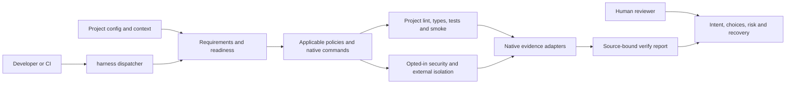

# Architecture Context

## Reviewer map

Current implementation, checked against source on 2026-10-07. The harness is a
local command coordinator; the separate reference app owns application logic.
Read the affected boundary below, then its ADR and source. This map focuses
review; it does not establish operational approval or test coverage.

The report path is `verify`; direct check/test/smoke still run separately and
plain test/smoke are not isolated. Missing tools or unsupported controls fail
visibly; a successful command is not a claim of complete assurance.

| Boundary | Responsibility / source | Key choice |
| --- | --- | --- |
| Public entry | [harness](../../../../harness), [common resolution](../../../../.harness/bin/common.sh) | Thin dispatcher; project-native commands remain authoritative |
| Requirements | [config](../../../../.harness/bin/config.py), [profiles](../../../../.harness/bin/profiles.py), [readiness](../../../../.harness/bin/readiness.py) | Resolve reviewed requirements before execution; contradictions do not remove controls ([ADR-008](../../../../docs/DECISIONS.md#adr-008-resolve-applicability-without-rewriting-reviewed-requirements)) |
| Policy and static checks | [check](../../../../.harness/bin/check), [static delegation](../../../../.harness/bin/static.py) | Policies precede one selected native check; no second linter ([ADR-009](../../../../docs/DECISIONS.md#adr-009-native-formatting-and-required-static-defaults)) |
| Application / kit tests | [test](../../../../.harness/bin/test), [self-test](../../../../.harness/bin/self-test) | Separate suites and environments; zero collection cannot pass ([ADR-004](../../../../docs/DECISIONS.md#adr-004-separate-application-runner-selection-from-harness-self-testing)) |
| Evidence | [verify](../../../../.harness/bin/verify.py), [report validation](../../../../.harness/bin/evidence_reports.py), [input identity](../../../../.harness/bin/evidence_identity.py) | Native results bound to tested inputs; unsigned evidence, not authenticity |
| Security | [security](../../../../.harness/bin/security.py), [isolation](../../../../.harness/bin/isolation.py) | Explicit setup and external macOS direct-egress controls; [trust limits](../../../../docs/SECURITY.md) |
| Ownership | [inventory](../../../../.harness/release-files.json), [manifest verifier](../../../../.harness/bin/manifest.py) | Exact shipped paths; preserve project context and additions ([ADR-006](../../../../docs/DECISIONS.md#adr-006-declare-release-ownership-by-exact-shipped-paths)) |
| Application | [Next.js implementation map](../../../../examples/nextjs-app/docs/ARCHITECTURE.md) | Separate project-owned package; no root aggregation |

**Review attention:** Removing a control, changing native adapters or modifying
release inputs can weaken assurance. Inspect those contracts and their tests,
not just the final exit status. CI runs the same native controls; remote
execution/protection remains unverified. The [reviewer
entry](../../../../docs/README.md) links
the task brief and evidence reading path.

**Operation and recovery:** Local macOS commands use synthetic test services and
disposable storage; runtime groups are cleaned best-effort. No production
deployment or general installer/updater exists. Native failures retain evidence
and fail the gate. Config/kit upgrades require a reviewed merge with conflicts
preserved; source changes can be reverted, while application data recovery is
project-owned. See [quality](../../../../docs/QUALITY.md) and
[security](../../../../docs/SECURITY.md) for limits.

## Step 12 production journeys

The project-owned reference native runner owns unique SQLite fixtures and local
production processes. It explicitly cleans recorded children on interruption;
test-only audit-trigger injection exercises the real transactional dependency.
Project-owned smoke-evidence.json reuses the native report adapter and is
required
for selected browser-ui. Legacy non-browser smoke remains exit-only; reviewed
adapters require actual collection.
The reference's verify adapter runs all journeys, a superset of its small smoke.

## Step 11 secured local data boundary

The standalone app now uses real disposable SQLite with library-sealed session
cookies referencing database-backed identities and revocable expiry. Thin HTTP
entry points validate runtime input; pure domain policy checks
owner/tenant/role.
Prepared statements, optimistic versions and transactional audit protect writes.
Dynamic pages/API reads are private and uncached. Production/SSO are
unsupported.
The fixed native server-evidence contract adds a required separately reported
control for reviewed identity/multi-tenancy/persistence capabilities; no
scenario
DSL or application-specific engine route is introduced. See the app's context.

## Step 10 application foundation

`examples/nextjs-app/` is a separately invoked project-owned package, outside
the
managed inventory. Real Next.js pages/layout render synthetic fixtures on the
server; small Client Components own theme/edit/dialog state. Native strict
TypeScript, ESLint/Next/hooks rules, Vitest and production Chromium navigation
check maintained TSX. Step 11 supersedes its fixture-only data boundary above.

Shared resolution recognizes the initial Next.js/browser contract only when
root package scripts declare build/test/smoke and a native evidence adapter is
reviewed. `verify` executes a required production-build row using the existing
lock-selected package manager. Reference smoke is real sign-in/save/reload, not
full accessibility/performance assurance. Missing contracts retain
unsupported controls. Root `analysis.exclude = ["examples", ...]` explicitly
keeps independent packages out of root aggregation; check each example root.

## Step 08 evidence coordination

Step 09 adds fixed native security adapters and external macOS test isolation,
not a policy DSL or self-sandbox. Shared selection activates reviewed local/ci
security requirements; schema 1 needs explicit project-owned security.json.
Advisory setup is network-enabled, separate from offline verify. Its native
package collections/source/time/version and lock/manifest-bound captures feed
security_reports.py; capture bytes also enter evidence identity. Gitleaks and
local Ruff/ESLint run under external Seatbelt. All commands get a clean
synthetic
environment and actual egress preflight; no unrestricted fallback. Plain native
test/smoke remain unisolated. The deprecated OS policy establishes only direct
process-network restriction, not hostile-code host/VM safety. See the
[security contract](../../../../.harness/security/README.md).

`verify.py` coordinates existing check/smoke and native test evidence adapters;
it does not implement a second scheduler or linter. Shared resolver requirements
remain intact. `evidence_reports.py` validates the fixed shipped JSON Schema
subset and parses native unittest/JUnit counts, including Node's direct cases.
`evidence_identity.py` snapshots conservative inputs/config/locks/untracked
files and the executing release inputs; fixed reports/runtime paths are
excluded.
`evidence_runner.py` bounds streaming logs, redacts credentials and cleans owned
POSIX groups. Snapshot comparisons reject stale/mid-run edits. Custom evidence
argv is project-owned `.harness/evidence.json`, never overwritten by adoption.
See the [contract](../../../../.harness/verification/README.md) for explicit
trust limits.

## Step 06 applicability boundary

Step 07 adds static.py as a fixed native default dispatcher and format as a thin
delegate. Optional commands.format preserves schema 1/2 reads. Explicit check
commands retain precedence; defaults require local tools rather than syntax-only
success. Python checks locate bundled Pyright without its network/bootstrap
wrapper. Consumer formatting excludes installed machinery; authoring CI covers
managed files explicitly. See
[QH-07](../../../plans/P002-quality-first-harness/evidence/QH-07.md).

`profiles.py` resolves reviewed language/framework/capability requirements and
source evidence independently of installed tools. Check, policies, inspect and
doctor share this selection. Contradictions retain the union and block check
before project-command delegation. `readiness.py` selects required context;
`doctor.py` adds prerequisite presence diagnostics, never executes quality
gates.
Next.js is dependency/review evidence, not a folder-name heuristic. Multiple
package manifests/workspaces or nontrivial declared roots return unsupported;
run package roots separately until aggregation is implemented.

Schema 1 remains readable without rewriting project-owned configuration.
Schema 2 is a manual, reviewable merge from
`.harness/config-v2.example.toml`, not an installer or automatic migration.

Status: current

## System shape

The root `harness` dispatcher invokes managed command implementations under
`.harness/bin/`. Commands validate project-owned TOML configuration, run managed
policy checks, and then delegate to project-native tools. Visible context
remains
project-owned; managed checks, standards, tests, and skills are
checksum-tracked.

Managed `default-config.toml` supplies fallback settings; the executing
repository's project-owned `config.toml` does not supply commands to unrelated
targets. Explicit CLI/environment/config commands retain precedence.

Application `test` and harness `self-test` are separate entry points. Python
application metadata declares pytest or unittest; absent metadata uses pytest
without inspecting module availability. The selected app environment owns its
runner. A small stdlib discovery adapter rejects empty unittest collections.
`self-test` selects the executing kit's suite and environment and ignores app
test overrides. This repository declares a direct, non-recursive suite command
in its own configuration. See [ADR-004](../../../../docs/DECISIONS.md).

Managed `source_paths.py` owns literal directory exclusion matching, pruned
tree traversal and supported executable shebang classification. Size, link,
claim scans share it. Scans skip all symlinks;
canonical policy inputs reject symlink components independently of exclusions.
Native tools retain their own configuration and discovery. Required policy
checks precede one project static-check implementation; overrides/package
scripts prevent an additional automatic Python stage. See
[ADR-005](../../../../docs/DECISIONS.md).

## Boundaries

Release ownership comes from `.harness/release-files.json`, not directory
enumeration. The checksum manifest has exactly those paths and includes the
inventory itself. Additional project skills, shared-folder notes and runtime
environments are outside release ownership. Both verification and release
generation validate canonical paths and reject shipped-file/metadata symlinks,
including parent links, before hashing inputs. See
[ADR-006](../../../../docs/DECISIONS.md).

Generation emits JSON to stdout as an explicit release-authoring operation.
Consumer checks never mutate metadata or repair a checksum conflict. The
schema remains 1; old kits require a reviewed inventory/verifier update.

| Component | Owns | May depend on | Must not depend on |
| --- | --- | --- | --- |
| Root dispatcher | Public command routing | `.harness/bin/` | Project implementation details |
| Managed commands | Resolution and orchestration | Config, checks, project commands | Overwriting project context |
| Policy checks | Cross-project invariants | Validated config and target files | Product-specific assumptions |
| Project tools | Language semantics and formatting | Project source/configuration | Managed harness ownership |

## External systems

| System | Purpose | Authentication | Failure behaviour | Real or simulated |
| --- | --- | --- | --- | --- |
| Local runtimes/tools | Execute configured checks | Local environment | Actionable failure for missing/failed required tools | Real |

## Runtime and deployment

The first supported platform is macOS. The dispatcher uses POSIX `sh`; TOML
validation and managed checks require Python 3.11 or newer. Project runtimes are
used only when a target profile requires them. Commands expose selected
profiles,
tool coverage, and failures without printing command bodies or secrets.

## Core CI

Core CI is a thin GitHub Actions workflow plus four native command phases under
`.harness/ci/`. CI inputs are repository-owned, not shipped consumer machinery.
Release ownership remains explicit; fixture-native configuration is shipped,
but CI dependencies and generated logs are not. A clean job installs exact
runtime/tool pins with hashed Python requirements, npm lockfiles and verified
shell binary digests. Job/command deadlines bound execution. See the
[CI guide](../../../../.harness/ci/README.md).

## Architectural risks

- Reviewed native commands own coverage and must be non-mutating; the harness
  cannot establish their adequacy by parsing arbitrary shell bodies.
- Tool configuration is shared ownership and requires conflict-aware merging in
  future adoption and upgrade flows.
- Editable release metadata is not signed and symlink checks do not defend
  against concurrent filesystem mutation. Verification assumes a stable tree.

## Target architecture agreed on 2026-10-01

The [product vision](../../../../docs/PRODUCT.md) retains the three ownership
layers and adds a
small programmatic control-selection and evidence pipeline. Selection and native
evidence coordination are implemented; Steps 10–12 add the real synthetic
Next.js
foundation, secured SQLite boundary and production journeys. The Python
reference
and adoption/update capabilities remain planned.

TypeScript and Python are the language profiles; Next.js is a framework profile
on TypeScript. Reviewed project capabilities activate additional controls for
browser UI, identity, persistence, and other actual boundaries. Detection must
not silently remove a configured requirement.

Project-native tools execute every automated gate. No LLM evaluator or external
model call grades verification. The coding agent can author and repair tests;
CI independently executes the required suite. Human product/design acceptance
and runtime permissions remain separate responsibilities.

Reusable application foundations are project-owned or explicitly versioned
dependencies. Customer-specific themes and features must not enter the managed
harness checksum inventory. Existing component systems take precedence over a
new default kit.

Implementation follows [the quality-first
plan](../../../plans/P002-quality-first-harness/README.md).
