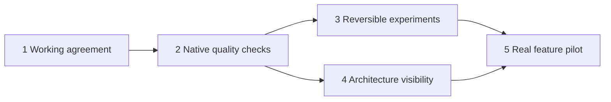

# P001 Lean harness rebuild

Status: In progress. T001 is complete; T002 is next.

Make it quick to try an idea, safe to discard it, and straightforward to retain
and improve it. Keep the code readable and give the user a reliable view of how
the application works. The first version consists of a working agreement,
native tool settings, isolation recipes and architecture views, proven on one
small feature using React, Next.js, Vercel and Neon.

The reset is complete. This plan builds forward from commit `0516ee6`; it does
not restore the old harness wholesale. The
[working agreement](../../docs/WORKFLOW.md) owns durable workflow rules. The
[architecture map](../../docs/ARCHITECTURE.md) owns current and intended
responsibilities.

## What changes by mode

| Mode | What we need to learn or deliver | Evidence required |
| --- | --- | --- |
| Explore | Does this idea or integration work? | A visible result, stated data boundary and a discard path |
| Build | Can we retain and extend it reliably? | Meaningful tests, edge cases and the real user journey |
| Release | Is it ready for its intended exposure? | Applicable security, recovery, migration and deployment proof |

Readability, native formatting and safe handling of secrets apply throughout.
The mode does not mandate a new architecture or a document for every prompt.

## Execution order

T003 and T004 can be developed independently after T002. Keep one bounded task
active at a time unless there is a concrete reason to work in parallel.

## P001 T001 Define the working agreement

Task ID: `P001-T001`. State: Complete. Completed: 2026-10-07.

**Outcome:** A practical agreement for Explore, Build and Release, including
readability, testing, refactoring and source-backed architecture views.

**Inspect:** The user's requests, surviving repository files and the supplied
operating contract. Challenge rules that add work without reducing an observed
problem. Keep the distinction between code recovery and external side effects.

**Deliver:** The [agreement](../../docs/WORKFLOW.md), an initial
[architecture map](../../docs/ARCHITECTURE.md), and this plan with embedded
tasks.
Use one plan file instead of a new document for every task or agent run.

**Proof:** Each mode states its purpose and required evidence. The plan gives
each remaining task an outcome, investigation, dependencies and acceptance.
The current map labels proposed behaviour and records that CI was removed.

**Reviewer brief:** This changes project guidance, not application behaviour.
The agreement uses the modes already discussed. Its main risk is becoming
paperwork; the pilot measures that overhead. Recovery is an ordinary document
edit. No data or deployed resources are affected.

**Verification:** See the verification section at the end of this plan. This
task proves that the foundation is recorded, not that it improves development.

## P001 T002 Make native quality checks runnable

Task ID: `P001-T002`. State: Next. Depends on: `P001-T001`.

**Outcome:** Formatting, lint, types and relevant tests run through familiar
project commands, with clear failures and no bespoke policy platform.

**Inspect:** Existing Next.js and TypeScript conventions in Data Miner, read
only; installed framework documentation; test runner support; and missing
formatting settings. Select and lock compatible tool versions before writing
their configuration.

**Reuse or build:** Use Prettier, ESLint with the Next.js and React rules,
TypeScript strict settings, and an existing compatible test runner. Define
concise BASE, NAMING, TESTING and ARCHITECTURE standards with relevant language
profiles before source implementation. Put tool settings in native files and
create a short agent entrypoint that links to the agreement and standards.
Test application settings in a tiny reference project rather than adding app
dependencies to the kit root. Run native checks locally first.

**Framework decisions to check:** Components follow responsibilities; derived
values do not create duplicate state. Reuse one accessible modal primitive with
content and variants rather than duplicate its interaction logic. Use server
components for appropriate reads and small client boundaries for interaction.
Validate and authorise mutations; keep database access server-only. Choose
freshness explicitly. Avoid an internal HTTP hop when server code can read the
source directly. Do not add a repository layer without a real separation need.

**SQL decisions to check:** Parameterised queries, appropriate types and
constraints, transactions for dependent writes, explicit duplicate and
concurrent update behaviour, versioned migrations and query-justified indexes.
PostgreSQL integration claims require PostgreSQL evidence. Choose a migration
tool for the actual driver and schema workflow; do not write a migration engine.

**Proof:** A readable sample passes format, lint, type and relevant behaviour
checks. Introduce one formatting, one type and one behaviour error to show the
appropriate command fails; fix them and rerun. Demonstrate the commands in the
kit and reference project. CI is outside this initial task.

**Reviewer brief:** Changes native configuration and a small reference app.
Start with a known rule tested before implementation and one exploratory UI.
Keep template settings distinct from consumer-owned settings. Recovery is
reverting the kit change; no existing application configuration is overwritten.

## P001 T003 Make experiments isolated and recoverable

Task ID: `P001-T003`. State: Planned. Depends on: `P001-T002`.

**Outcome:** Try a feature without disturbing retained work; discard its code,
data and temporary resources through a documented, verified procedure.

**Inspect:** Git worktree behaviour with a dirty parent checkout, local runtime
and port isolation, Vercel environment variable scoping, Neon branch creation,
data inheritance, migration timing and resource cleanup in the actual
integration. Check which system owns branch deletion rather than assuming
cleanup follows Git.

**Reuse or build:** Start with Git worktrees and a short resource inventory.
Use a disposable PostgreSQL database locally. Prepare a Vercel Preview and
isolated Neon database recipe with synthetic seed data. Use schema-only
branching when a parent contains data that should not enter an experiment.
Promote code and schema changes deliberately, not experiment data. Add a small
helper only if the manual recipe proves error-prone.

**Needs:** A disposable test project and PostgreSQL runtime. Live acceptance
also needs an authorised Vercel test project and Neon test database with access
to their configuration. Prepare the recipe and local checks before requesting
service access. Production access is outside this task.

**Proof:** Run an experiment from a checkout with unrelated changes. Confirm the
parent files are preserved. Make an isolated database write and show it does
not alter the retained database. Apply a migration in isolation. Discard the
experiment and verify every resource in its inventory is removed or retained
intentionally. Recreate it from recorded inputs. Demonstrate application and
database recovery separately. Label local-only proof if live access is absent.

**Reviewer brief:** This introduces checkout, runtime and database boundaries.
A worktree alone is insufficient. Confirm target identifiers before cleanup;
never use shared history resets or inherited production credentials. Keep a
recoverable snapshot for any retained changes before deleting an experiment.

## P001 T004 Explain the architecture and each change

Task ID: `P001-T004`. State: Planned. Depends on: `P001-T002`.

**Outcome:** The user can understand how the app works and what a change enables
without reading the entire codebase.

**Inspect:** One reference feature's source owners, state, data flow and failure
paths. Compare what can be extracted reliably from code with what needs a human
or agent explanation. Identify the information the user actually needs to judge
a change; an exhaustive import graph is unlikely to answer that question.

**Reuse or build:** Begin with Mermaid diagrams and source links in existing
project context. Provide an application overview, one input-to-result feature
flow and a before-and-after change view. Keep a short explanation of intent,
affected boundaries, benefit and proof alongside it. Label fixtures, intended
designs and currently exercised integrations. Reuse these views in task briefs.

**Proof:** Match every node and arrow to source or an explicit planned label.
Open the diagrams in a renderer and follow the source links. The user should
be able to identify where state lives, where a write happens and what changed
from the view alone. Use two minutes as an initial comprehension target, not
a proven benchmark; user feedback is required to establish success.

**Reviewer brief:** This adds explanation, not an application runtime
dependency.
The risk is a convincing but stale diagram. Update it with boundary changes and
compare it to source during review. Drop unnecessary detail before introducing
a scanner or dashboard. Recovery is a document edit.

## P001 T005 Prove the approach on a real feature

Task ID: `P001-T005`. State: Planned. Depends on: `P001-T003`, `P001-T004`.

**Outcome:** Evidence that the workflow can produce a fast experiment, a
reliable retained feature and an understandable architecture on the stack we
use.

**Inspect:** The completed recipes and native checks. Choose a small feature
with a visible interaction, one persisted operation and a meaningful failure
case. A candidate is editing a saved item through a reusable modal. Start in
a disposable reference app; inspect Data Miner as a subsequent adoption target
without modifying it during the kit pilot.

**Run:** Explore the interaction and demonstrate discard. Recreate or promote
the useful result in Build; add tests for validation, duplicates or concurrent
updates as applicable. Extend it without duplicating its modal or data rules.
Prepare Release evidence in an authorised preview environment, including
access boundaries, migration and recovery. Production deployment is a separate
authorised action. Perform a refactoring review; record either a justified small
refactor or why no refactor is needed.

**Needs:** T003's disposable resources and access for live Vercel and Neon
proof. User review is needed for usefulness and comprehension. Local tests can
proceed independently, but cannot complete the live integration claims.

**Proof:** The feature works through the actual browser and PostgreSQL path,
retained behaviour survives an extension, the experiment is removable, and the
architecture view answers the user's questions. Record failed attempts as well
as successes. Inspect code readability and dependency choices directly.

**Reviewer brief:** The pilot tests the method on a bounded example. It cannot
prove a universal productivity gain. Do not expand it into a second product or
refactor Data Miner as a side effect. Recovery uses the verified discard recipe.

## How we judge whether this helps

Record these observations in the pilot task; use a small table, not a telemetry
service. Agree a comparable feature scope before judging speed.

- Time from the request to the first usable result, separating setup and access
  delays from implementation and process overhead. Five to ten minutes is an
  ambition for a tiny prepared experiment, not a promise for arbitrary features.
- Regression and rework after extending retained behaviour. A test count is not
  a substitute for successful journeys and useful failure coverage.
- Time and resources needed to discard and reproduce the experiment.
- Whether the user can explain the architecture and change from the views.
- Files, dependencies and documentation added, with reasons. Fewer files alone
  is not proof of better design; judge cohesion and ease of change.

Use a recorded baseline when available; otherwise say that the first pilot is
a feasibility result and establishes a baseline. Three comparable later changes
can give a directional comparison, with task differences recorded. Keep the
workflow only if it supports useful results with acceptable rework and overhead.
Remove a rule when its cost is evident and its benefit is not.

## Deferred until the pilot identifies a need

A dashboard, automatic architecture scanner, installer and update protocol,
custom gate engine, universal task tracker, CI setup, cost optimisation and
speculative capacity work. We can add a focused capability when an observed
recurring failure or adoption need makes its value clear.

## Primary guidance to check during implementation

- [Thinking in React](https://react.dev/learn/thinking-in-react)
- [Next.js server and client components](https://nextjs.org/docs/app/getting-started/server-and-client-components)
- [Next.js data security](https://nextjs.org/docs/app/guides/data-security)
- [Next.js backend for frontend](https://nextjs.org/docs/app/guides/backend-for-frontend)
- [PostgreSQL constraints](https://www.postgresql.org/docs/current/ddl-constraints.html)
- [PostgreSQL transactions](https://www.postgresql.org/docs/current/tutorial-transactions.html)
- [Vercel environments](https://vercel.com/docs/deployments/environments)
- [Neon branches with Vercel previews](https://neon.com/blog/neon-skills-landed-in-the-vercel-cli)
- [Opportunistic refactoring](https://martinfowler.com/bliki/OpportunisticRefactoring.html)

These guide implementation choices. They are not evidence that this kit or a
consumer application already complies. Check installed framework versions and
the actual Vercel and Neon setup when executing the relevant task.

## Foundation verification

P001-T001 verification on 2026-10-07:

| Check | Result |
| --- | --- |
| `python3` document inspection | Passed for all six Markdown files: UTF-8, final newlines, whitespace, 80-column prose and paired code fences |
| Relative link inspection | All 12 local file links resolve |
| Plan and agreement inspection | Five task IDs include their parent plan ID; all three modes are defined |
| Filesystem inspection | The removed GitHub CI workflow is absent |
| `git diff --check` | Passed |

The Python inspection was a one-off read-only check, not a new harness command.
Tables and URLs use the agreed width exceptions. Diagrams have not been
rendered, and user comprehension has not been tested; those are T004 outcomes.

No executable `harness` command exists after the reset. `./harness check`,
`./harness test` and `./harness project sync` were not run because their
implementation is absent. No application, database or deployment acceptance
is claimed by this documentation task.
